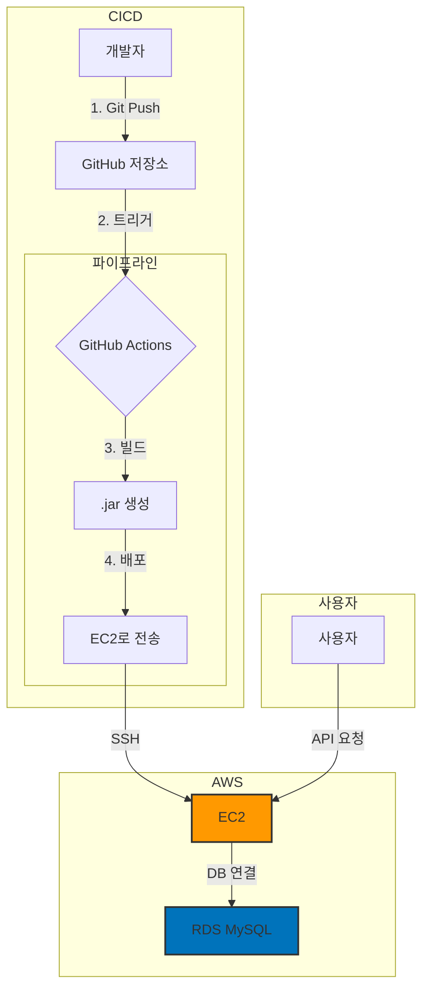

# 농수축산물 도매가격 조회 및 커뮤니티

## 1. 프로젝트 소개

매일 변동되는 농수축산물 가격을 사용자가 쉽고 빠르게 파악할 수 있는 방법을 고민하며 이 프로젝트를 시작했습니다.
농림축산식품 공공데이터 포털에서 제공하는 API를 활용하여 신뢰도 있는 가격 정보를 제공하고 커뮤니티를 통해 살아있는 정보가 오가는 플랫폼을 만들고자 했습니다.

이 프로젝트는 단순히 기능을 구현하는 것을 넘어 신입 개발자로서 마주할 수 있는 다양한 기술적 문제들을 주도적으로 해결하는 과정에 집중했습니다. **N+1 문제 해결, 동적 쿼리 구현, 클라우드 인프라 설계, CI/CD 파이프라인 구축 및 트러블슈팅** 등 백엔드 개발자에게 필수적인 역량을 깊이 있게 고민하고 적용했습니다.

---

###  **프로젝트 URL & API 문서**

- **[프로젝트 URL](http://15.164.234.103:8080)**
- **[API 문서 (Swagger)](http://15.164.234.103:8080/swagger-ui/index.html)**

---

## 2. 주요 기능

- **가격 조회**: 지도를 통해 전국의 주요 도매시장을 선택하고, 날짜 별 농수축산물 가격을 조회합니다.
- **검색**: 특정 품목, 품목 분류, 날짜 등 다양한 조건으로 가격 정보를 필터링하고 검색할 수 있습니다.
- **사용자 인증**: JWT(JSON Web Token)를 이용한 API 기반의 회원가입 및 로그인 기능을 제공합니다.
- **커뮤니티**: 각 도매시장별 게시판에서 사용자들이 게시글을 작성, 조회, 삭제하는 등 소통할 수 있습니다.

## 3. API 명세

| 기능 | HTTP Method | URL | 설명 |
| --- | --- | --- | --- |
| **회원가입** | `POST` | `/api/auth/register` | 신규 사용자 등록 |
| **로그인** | `POST` | `/api/auth/login` | 로그인 및 JWT 발급 |
| **게시글 작성** | `POST` | `/api/posts` | 신규 게시글 작성 (인증 필요) |
| **게시글 목록 조회**| `GET` | `/api/posts` | 게시글 목록 조회 |
| **가격 정보 조회** | `GET` | `/api/prices` | 가격 정보 조회 |

## 4. 적용 기술 및 개발 환경

- **Backend**: `Java`, `Spring Boot`, `Spring Security`, `Spring Data JPA`
- **Database**: `MySQL`, `QueryDSL`
- **DevOps**: `GitHub Actions`, `AWS EC2`, `AWS RDS`

## 5. 전체 시스템 아키텍처

<b>클릭하여 아키텍처 확인하기</b>

개발부터 배포, 서비스 운영까지의 전체 흐름을 나타내는 아키텍처 다이어그램입니다.

## 6. 문제 해결 및 개선 경험

이 프로젝트를 진행하며 마주했던 주요 기술적 문제들과 해결 과정입니다.

### **데이터베이스 설계 및 최적화**
- **데이터 무결성 보장 (트랜잭션 관리)**
    - **문제점**: 여러 데이터베이스 작업이 하나의 비즈니스 로직으로 묶여있을 때 중간에 한 작업이라도 실패하면 데이터가 오염될 위험이 있습니다.
    - **해결 과정**: **`@Transactional`** 어노테이션을 서비스 계층에 적용하여, 모든 DB 작업을 하나의 단위로 묶었습니다. 이를 통해 작업 중 하나라도 실패하면 모든 변경사항이 롤백(Rollback)되어 데이터의 일관성과 무결성을 보장합니다.

- **인덱스를 통한 조회 성능 최적화**
    - **문제점**: 사용자가 늘어날수록 `findByUsername` 메소드의 성능이 저하될 수 있습니다. 인덱스가 없는 컬럼에 대한 조회는 `Full Table Scan`을 유발하여 데이터가 많아질수록 속도가 급격히 느려집니다.
    - **해결 과정**: `users` 테이블의 `username` 컬럼에 **데이터베이스 인덱스(Index)**를 적용했습니다. `@Table(indexes = ...)` 어노테이션을 사용하여 인덱스가 생성되도록 관리했습니다.
    - **결과**: `Full Table Scan`을 방지하고 인덱스를 통한 빠른 조회가 가능해져 로그인 성능을 안정적으로 유지할 수 있게 되었습니다.

### **쿼리 성능 개선: N+1 문제 해결**
- **문제점**: 게시글 목록을 조회할 때 게시글을 가져오는 1개의 쿼리 이후 각 게시글의 작성자 정보를 얻기 위해 N개의 추가 쿼리가 발생하는 **N+1 문제**를 발견했습니다.
- **해결 과정**: `지연 로딩`으로 설정된 연관 관계는 유지하되 목록 조회 시에는 `페치 조인`**을 사용하여 게시글과 사용자 정보를 단 하나의 쿼리로 함께 가져오도록 구현했습니다.
- **결과**: 불필요한 데이터베이스 접근을 제거하여 **API 응답 시간을 크게 단축**하고 DB 부하를 줄였습니다.

### **CI/CD 파이프라인 구축 및 아키텍처 개선**
- **이유**: 개발 생산성을 높이고 안정적인 배포 환경을 갖추기 위해 **GitHub Actions**를 이용한 배포 자동화 파이프라인을 구축했습니다.
- **아키텍처 개선**: 초기 배포 시, EC2 인스턴스에 Spring Boot 애플리케이션과 MySQL을 함께 실행했을 때 메모리 부족으로 서버가 멈추는 현상을 겪었습니다. 로그 분석을 통해 리소스 부족을 원인으로 진단하고, **데이터베이스를 AWS RDS로 분리**하여 서버 부하를 줄이는 아키텍처 개선을 진행했습니다. 이를 통해 보다 안정적이고 확장성 있는 인프라를 구축했습니다.
- **결과**: GitHub에 코드를 푸시하는 것만으로 **테스트, 빌드, 배포**까지 완료되는 완전 자동화 파이프라인을 완성했습니다.

### **API 키 보안**
- 하드코딩되어 있던 외부 API 키와 JWT 시크릿 키를 **GitHub Secrets**와 **환경 변수**를 이용해 외부로 분리했습니다. 이를 통해 코드 저장소에 민감한 정보가 노출될 위험을 제거했습니다.

### **단위 테스트를 통한 코드 신뢰성 확보**

**JUnit5**와 **Mockito**를 활용하여 서비스 계층의 핵심 로직에 대한 단위 테스트를 작성했습니다.

외부 의존성을 가진 객체(Repository 등)는 Mock 객체로 대체하여, 순수 비즈니스 로직이 다양한 시나리오(성공, 실패, 예외 등)에서 의도대로 동작하는지 검증했습니다. 이를 통해 코드 변경 시 발생할 수 있는 잠재적 버그를 사전에 방지하고, CI 파이프라인에 테스트 자동화 단계를 포함하여 코드의 안정성을 유지했습니다.

---

> **Note**: 이 프로젝트의 프론트엔드(HTML, CSS, JavaScript)는 AI의 도움을 받아 생성되었습니다. 저의 주된 역할은 위에 기술된 백엔드 시스템 설계 및 구현에 있습니다.
